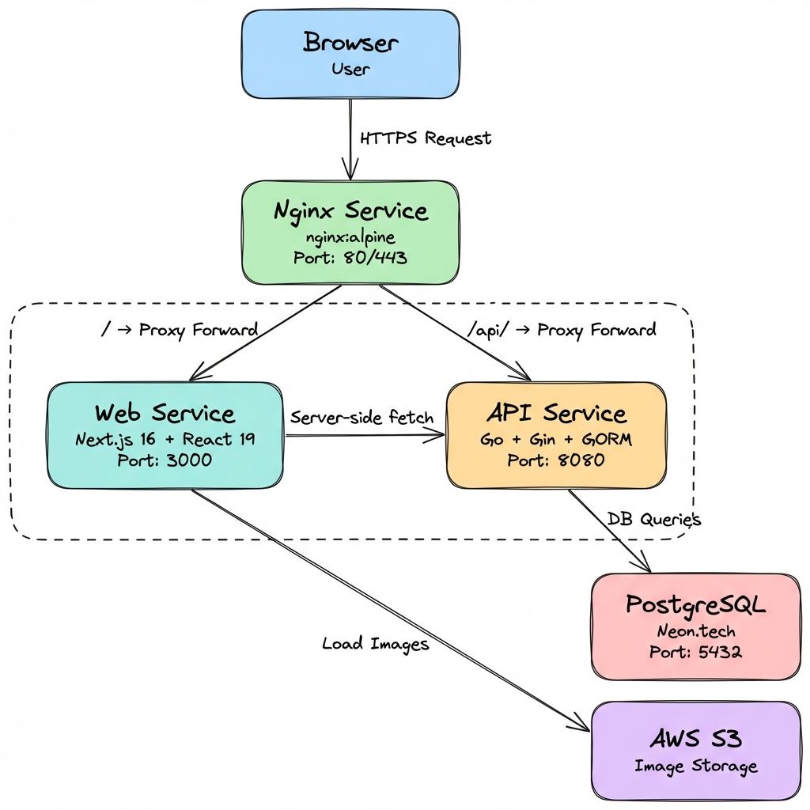

# Kurai Arc


<div align="center">
  
</div>

**Kurai Arc** is a premium e-commerce platform designed for exclusive fashion drops. Built with **Go** backend and **Next.js** frontend.

---

## Technology Stack

### Backend (kurai-arc-api)
- **Language**: [Go](https://go.dev/) (Golang) v1.25+
- **Framework**: [Gin Web Framework](https://github.com/gin-gonic/gin)
- **ORM**: [GORM](https://gorm.io/)
- **Database**: PostgreSQL (Neon.tech)

### Frontend (kurai-arc-web)
- **Framework**: [Next.js](https://nextjs.org/) v16 (App Router)
- **Library**: React 19
- **Styling**: [Tailwind CSS](https://tailwindcss.com/) v4
- **Language**: TypeScript

### Infrastructure
- **Containerization**: Docker & Docker Compose
- **Image Hosting**: AWS S3
- **Deployment**: Ready for cloud deployment (AWS, DigitalOcean, etc.)
- **Reverse Proxy**: Nginx (routes traffic to frontend and API)


### Nginx Configuration
The project uses Nginx as a reverse proxy to handle incoming requests on port 80:
- **Frontend**: Requests to `/` are routed to the Next.js container (internal port 3000).
- **Backend**: Requests to `/api/` are routed to the Go API container (internal port 8080).

---

## Architecture

<p align="center">
  
</p>

---

## Getting Started

### Prerequisites
- [Go](https://go.dev/dl/) 1.25+
- [Node.js](https://nodejs.org/) 20+
- [Docker Desktop](https://www.docker.com/products/docker-desktop/)

### Installation

1.  **Clone the repository**
    ```bash
    git clone https://github.com/KostiantynYarosh/kurai-arc.git
    cd kurai-arc
    ```

2.  **Environment Setup**
    Create `.env` files for both services.

    **Backend (`kurai-arc-api/.env`)**:
    ```ini
    DB_HOST=your-neon-host
    DB_USER=your-db-user
    DB_PASSWORD=your-db-password
    DB_NAME=db-name
    DB_PORT=port
    DB_SSLMODE=require
    ```

    **Frontend for local development (`kurai-arc-web/.env.local`)**:
    ```ini
    NEXT_PUBLIC_API_URL=http://localhost:8080/api
    INTERNAL_API_URL=http://api:8080/api
    ```

3.  **Run with Docker Compose (Production/Staging)**
    The default `docker-compose.yml` uses pre-built images from Docker Hub.
    ```bash
    docker compose up -d
    ```

4. **Build from Source (Local Development)**
    If you want to build the images locally (e.g. for development), use the local compose file:
    ```bash
    docker compose -f docker-compose.yml.local up --build
    ```

### Building & Pushing Images
To build and push new images to Docker Hub (for `kot3qq/kurai-web` and `kot3qq/kurai-api`), you can use the provided script:

**Windows (PowerShell)**:
```powershell
.\scripts\build_and_push.ps1
```

**Linux/Mac**:
```bash
# Ensure script is executable first: chmod +x scripts/build_and_push.sh
./scripts/build_and_push.sh
```

### Local Development (Manual)

**Backend**:
```bash
cd kurai-arc-api
go mod download
go run cmd/api/main.go
```

**Frontend**:
```bash
cd kurai-arc-web
npm install
npm run dev
```

---

## SSL Configuration (HTTPS)

To enable HTTPS, you must generate SSL certificates on the server using **Certbot** (Let's Encrypt).

1.  **Stop Containers** (free up port 80):
    ```bash
    docker compose down
    ```

2.  **Run the Setup Script**:
    Run `scripts/setup_ec2.sh` to install Certbot (if not already installed).

3.  **Generate Certificates**:
    Replace `your@email.com` and `yourdomain.com` with your actual details:
    ```bash
    sudo certbot certonly --standalone -d yourdomain.com -d www.yourdomain.com --email your@email.com --agree-tos --no-eff-email
    ```

4.  **Restart Containers**:
    The `docker-compose.yml` is already configured to mount certificates from `/etc/letsencrypt/`.
    ```bash
    docker compose up -d
    ```

---


## API Endpoints

| Method | Endpoint | Description |
| :--- | :--- | :--- |
| `GET` | `/api/collections` | Fetch all collections |
| `GET` | `/api/products` | Fetch all products (optional `?collection=slug`) |
| `GET` | `/api/products/:slug` | Fetch a single product by slug |
| `POST` | `/api/orders` | Create a new order |

---

## Project Structure

```
kurai.arc/
├── docker-compose.yml   # Orchestrates API and Web services
├── nginx/               # Nginx Configuration
│   └── default.conf     # Reverse proxy settings
├── kurai-arc-web/           # Next.js Frontend
│   ├── src/app/         # App Router pages
│   ├── src/components/  # React components
│   └── ...
└── kurai-arc-api/       # Go Backend
    ├── cmd/api/         # Entry point
    ├── internal/        # Application code
    │   ├── handlers/    # HTTP handlers
    │   ├── models/      # Data structures & SQL
    │   └── repository/  # DB access
    └── ...
```

Made with 🖤 by Kurai Arc Team.
